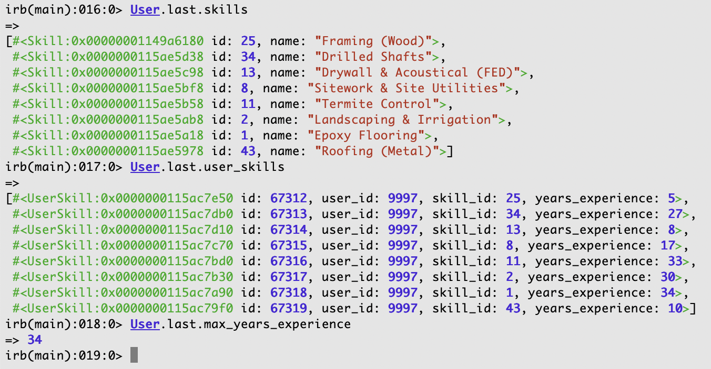

# User Skills Exercise

## Installation

Requirements:

* Ruby 3.2.2
* Rails 7.0.8
* SQLite

```bash
$ bundle install
$ rails db:setup
```

## Data Structure

We have this basic data structure:


Each worker has the concept of the "maximum years of experience," which is the maximum experience they have in any one of their associated skills. For example, if a worker has 8 skills, each ranging of years of experience from 5-34 years, then that worker would have a maximum years of experience of 34 years.

Here is what this might look like in the Rails console:



## Exercise

1. Update the main page to:
  - Only include 50 workers
  - Ordered by their maximum years of experience (as defined above)
  - With the highest number of years experience at the top
2. Update the main page to look like [this Figma design](https://www.figma.com/file/IGrW9BbtG4AtW8E2bU2IoW/Coding-Sample?type=design&node-id=2-2&mode=design&t=XabrHnjlZd4aXejF-0)
  - You should use the `ApplicationController#current_user` method (you do not need to build an auth system)
3. Implement the "Save" functionality, preferably using Hotwire
  - You should use the `user_saves` table that exists in the database to store the saves (see the ERD for details)
