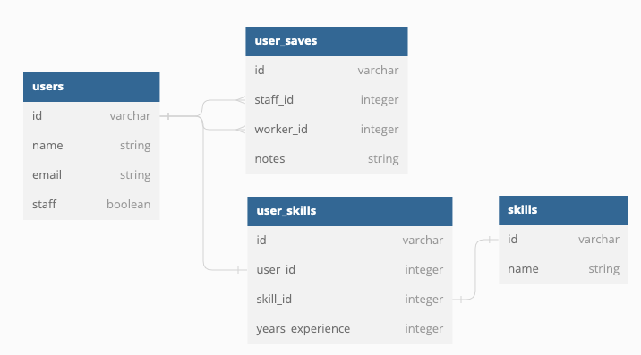

# User Skills Exercise

Given this basic data structure:

A user's total years of experience is defined as the maximum number of years they have in any of their skills.

We would like to show a list of all users and the number of years of experience for each user.

- How might you implement this?
- What are some of the challenges we will face in displaying this list of users?
- What if we want to order these users by experience?